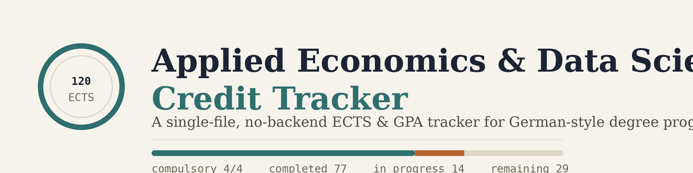

# Applied Economics & Data Science Credit Tracker

A single-file, no-backend ECTS credit and GPA tracker built for the **Applied Economics and Data Science** master's program at **Carl von Ossietzky University of Oldenburg**. Everything runs in your browser: no account, no server, no database.

---

## Why this exists

Tracking ECTS credits across five categories, dozens of elective options, German grading rules, and semester-by-semester planning in a spreadsheet gets messy fast. This tracker keeps it all in one place: what you've taken, what's left, whether you're on track to graduate, and what your GPA actually is once German grading quirks (like a 5.0 not earning credit) are accounted for.

## Features

**Credit tracking**

- Five categories (Economics, Empirical Methods, Data Science, Specialization, Thesis) plus an "Additional" category for extra courses that don't count toward your 120 ECTS
- Autocomplete from the program's official module catalog, with ECTS, language of instruction, workload, professor, exam type, and Stud.IP links filled in automatically
- Compulsory vs. elective labeling, with a live "compulsory courses completed" indicator
- Retake tracking (attempt 2, attempt 3), with the standard 3-attempt limit enforced

**Grades & GPA**

- German grading scale only (1.0, 1.3, 1.7 ... 4.0, 5.0), selected from a dropdown, not free text
- A 5.0 correctly excludes that course's ECTS and grade from your totals (it's a fail, not a credit)
- Overall GPA, per-category GPA, grade distribution chart, and a GPA-by-semester trend line
- "What-if" mode: add hypothetical courses and grades to preview their effect on your GPA, without touching your real record

**Planning**

- Semester dropdown (WiSe/SoSe) that respects each module's actual offering pattern, defaulting to the current semester
- Drag and drop between categories and semesters, with rules that mirror how credit transfers actually work (e.g. a course moved to Specialization can only be dragged back to its original category)
- A graduation checklist: missing ECTS, missing compulsory courses, completed courses with no grade entered yet

**Data**

- CSV and JSON export/import for bulk operations and backups
- QR code sharing for quick small transfers between your own devices (built from scratch, no external QR library)
- A backup reminder if you haven't exported in a while
- Everything is stored locally in your browser; nothing is sent anywhere except the optional cross-user visit counter

## Data source and accuracy

Module details (ECTS, professors, exam types, semester offerings, Stud.IP links) were transcribed from the official module handbook and Stud.IP course pages current as of mid-2026. Course offerings, staff, and requirements change between semesters. **Always verify against Stud.IP before making real academic decisions based on this tool.** This is a personal planning aid, not an official university system.

## Tech notes

- Plain React (no build tooling required to read or edit `ects-tracker.jsx`); the standalone build is produced with esbuild, bundling React, ReactDOM, and hand-rolled inline-SVG icons into one file
- No `localStorage`/`sessionStorage` inside the Claude artifact context; instead uses Claude's `window.storage` API, which the standalone build shims with real `localStorage`
- The QR code encoder is a from-scratch implementation of the relevant parts of ISO/IEC 18004 (versions 1-10, error correction level L), validated by round-tripping through an independent decoder

## License

MIT. See [`LICENSE`](./LICENSE).

## Disclaimer

Not affiliated with or endorsed by Carl von Ossietzky University of Oldenburg. Built by a student, for students.
