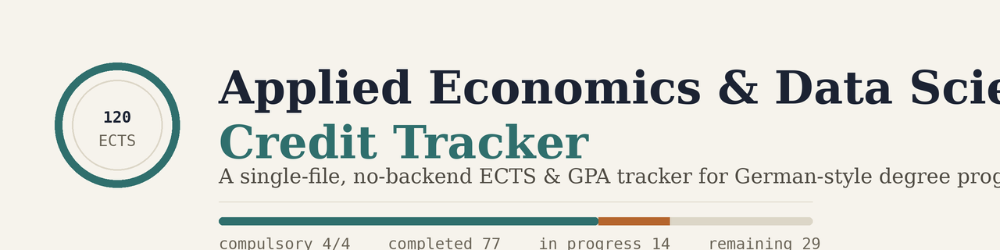

# Applied Economics & Data Science Credit Tracker

A single-file, no-backend ECTS credit and GPA tracker built for the **Applied Economics and Data Science** master's program at **Carl von Ossietzky University of Oldenburg**. Everything runs in your browser: no account, no server, no database.

---

## Why this exists

Tracking ECTS credits across five categories, dozens of elective options, German grading rules, and semester-by-semester planning in a spreadsheet gets messy fast. This tracker keeps it all in one place: what you've taken, what's left, whether you're on track to graduate, and what your GPA actually is once German grading quirks (like a 5.0 not earning credit) are accounted for.

## Features

**Credit tracking**

- Five categories (Economics, Empirical Methods, Data Science, Specialization, Thesis) plus an "Additional" category for extra courses that don't count toward your 120 ECTS
- Autocomplete from the program's official module catalog, with ECTS, language of instruction, workload, professor, exam type, and Stud.IP links filled in automatically
- Compulsory vs. elective labeling, with a live "compulsory courses completed" indicator
- Retake tracking (attempt 2, attempt 3), with the standard 3-attempt limit enforced

**Grades & GPA**

- German grading scale only (1.0, 1.3, 1.7 ... 4.0, 5.0), selected from a dropdown, not free text
- A 5.0 correctly excludes that course's ECTS and grade from your totals (it's a fail, not a credit)
- Overall GPA, per-category GPA, grade distribution chart, and a GPA-by-semester trend line
- "What-if" mode: add hypothetical courses and grades to preview their effect on your GPA, without touching your real record

**Planning**

- A collapsible "Open in <current semester> · Not yet taken" panel above the category board, listing catalog courses offered this semester that you have not taken yet; its chips can be dragged straight onto their own category (or Specialization, for electives) to add them as planned courses
- The semester dropdown for a catalog course only offers the semesters that course was actually offered in on Stud.IP, so a course cannot be scheduled into a semester it does not run in
- A course detail preview in the add-course form: professor, exam type, language, offered semesters, offering-pattern hint ("Typically offered: only in WiSe"), skills, and Stud.IP link
- A graduation checklist with per-category status ticks: ✓ for categories fully completed with a grade, ◐ for categories whose ECTS gap is covered but still include planned/in-progress courses, ○ for categories genuinely short; the four compulsory courses are listed individually with the same done/planned/missing distinction
- Checklist warnings for elective courses that have not been offered recently ("last offered X, whether it will reopen is uncertain" — compulsory courses are excluded from this warning, since they run every semester by definition) and "last chance this semester" alerts for compulsory courses that are open now but typically run only once a year
- A graduation path simulation in the Checklist tab: a semester-by-semester schedule for all remaining requirements (30 ECTS/semester cap), based on when courses were actually offered, with "(likely)" markers where the usual WiSe/SoSe rhythm is assumed; it never schedules anything (including the thesis) earlier than the last semester you already have planned or in-progress courses in
- A dedicated "Next semester" tab that proposes two alternative course selections for the upcoming semester specifically, starting from whatever you've already planned for it and filling the rest from what's typically offered and what you've already passed
- Drag and drop between categories and semesters, with rules that mirror how credit transfers actually work (e.g. a course moved to Specialization can only be dragged back to its original category; compulsory courses cannot be moved to Specialization)

**Course ratings**

- An anonymous, crowd-sourced course difficulty rating (1-5) shown when adding a course, alongside the average rating and vote count
- You can add, change, or remove your own rating at any time; votes are tracked per anonymous device, not per person, so re-rating a course just updates your existing vote instead of adding a duplicate
- Ratings are collected via a lightweight serverless pipeline (a GitHub Actions workflow appends each vote to a log and republishes the aggregate) and stored transparently in `ratings.json` in this repository, so anyone can inspect how the numbers are produced

**Data**

- CSV and JSON export/import for bulk operations and backups
- Automatic rolling backups (last 5 versions) of your data on every change, restorable via Load > Restore auto-backup
- QR code sharing for quick small transfers between your own devices (built from scratch, no external QR library)
- A backup reminder if you haven't exported in a while
- Course records automatically follow catalog renames (matched by module code on load), and a "New in catalog since your last visit" note appears when the daily sync picks up new modules
- A "Catalog updated" date in the footer showing when the module catalog was last synced from Stud.IP
- Everything is stored locally in your browser; nothing is sent anywhere except the optional cross-user visit counter

## Automatic catalog updates

The module catalog lives in `catalog.csv` (one row per module: `category, code, name, ects, compulsory, source, offering, semesters_offered, language, professor, exam_type, contact_hours, studip_link, skills`) and is kept in sync with Stud.IP automatically:

- `index.html` loads `catalog.csv` at startup and builds its module lists and course details from it, so the CSV is the single source of truth
- `scripts/fetch_catalog.py` scrapes the public AEDS course-of-study pages on Stud.IP (no login required) for every semester from WiSe 2021/22 up to the next semester and syncs the results into `catalog.csv`, including the exact semesters each module was offered in (`semesters_offered`): new modules are added, existing rows are updated, and rows with `source=studip` that appear in no scraped semester at all are removed. Deletion is skipped entirely unless at least 6 well-populated semester listings were fetched, so a partial scrape cannot wipe the catalog. The hand-maintained `compulsory` column always survives updates
- Rows whose `source` is anything other than `studip` (use `manual`) are never deleted or auto-removed; use this for modules you add by hand that the scraper does not see
- A GitHub Actions workflow (`.github/workflows/update-catalog.yml`) re-runs the scraper every morning and commits `catalog.csv` when it changed, with a changelog-style commit message (`chore: catalog update (add wir9xx; remove inf5xx; update N modules)`), so the git history doubles as a catalog changelog
- The CSV can also be edited by hand (e.g. to fix a professor name or add a module the scraper does not see); the scraper only overwrites fields it actually scraped fresh values for
- If `catalog.csv` cannot be loaded (e.g. opening `index.html` directly from disk), the app falls back to a built-in snapshot of the catalog

## Tech notes

- Plain React bundled with esbuild into a single `index.html` (React, ReactDOM, and hand-rolled inline-SVG icons in one file); catalog loading, the CSV parser, and the auto-backup ring live in small readable scripts in the page head
- The QR code encoder is a from-scratch implementation of the relevant parts of ISO/IEC 18004 (versions 1-10, error correction level L), validated by round-tripping through an independent decoder

## License

MIT. See [`LICENSE`](./LICENSE).

## Disclaimer

Not affiliated with or endorsed by Carl von Ossietzky University of Oldenburg. Built by a student, for students.
